# A step-by-step guide to goodness of fit figures of NONMEM models in R using ggplot2

- .Rmd, .html 파일 참조

## **GOF(Goodness Of Fit)**  
- Population model predictions vs observations  
- Individual model predictions vs observations  
- Conditional weighted residuals vs population predictions    
- Conditional weighted residuals vs time  
- Individual + population model prediction and observations over time per individual

## libraries
```{r}
library(xpose4)
library(tidyverse)
library(ggforce)
```

## data
- ID
- TIME
- DV : observations
- IPRED or IPRE : individual prediction
- CPREDI : FO conditional prediction with full interaction
- CRESI : FO conditional residuals with full interaction
- CWRESI : FO conditional weighted residuals with full interaction
- PRED : population prediction  

``` r
data <- read.csv("/Estimation_dataset.csv")
head(data)
```

    ##   ID TIME   DV AMT EVID CMT
    ## 1  1    0 0.00 100    1   1
    ## 2  1    1 2.91   .    0   2
    ## 3  1    2 1.92   .    0   2
    ## 4  1    3 2.89   .    0   2
    ## 5  1    4 3.39   .    0   2
    ## 6  1    5 3.25   .    0   2
    
 ``` r
df <- read.table("/SDTABModel001.txt", sep="", skip=1, header=T)
head(df)
```

    ##   ID TIME   DV CMT    IPRE  CPREDI    CRESI     CWRESI DV.1    PRED
    ## 1  1    0 0.00   1 0.00001 0.00001  0.00000  0.0000000 0.00 0.00001
    ## 2  1    1 2.91   2 2.48320 3.01170 -0.10166  0.2046300 2.91 3.05480
    ## 3  1    2 1.92   2 3.40430 4.01520 -2.09520 -1.3359000 1.92 4.02540
    ## 4  1    3 2.89   2 3.57670 4.08440 -1.19440 -0.7090800 2.89 4.04610
    ## 5  1    4 3.39   2 3.40870 3.75230 -0.36228 -0.1870700 3.39 3.67340
    ## 6  1    5 3.25   2 3.10260 3.27820 -0.02823 -0.0063824 3.25 3.17380
    ##         RES       WRES
    ## 1  0.000000  0.0000000
    ## 2 -0.144770  0.3057200
    ## 3 -2.105400 -1.2557000
    ## 4 -1.156100 -0.6660300
    ## 5 -0.283370 -0.1657000
    ## 6  0.076235 -0.0081955
    
## 1. Population/individual model predictions versus observations

``` r
ggplot(data = df, aes(x=PRED, y=DV)) +
  geom_point() + ## Add points
  geom_abline(intercept=0, slope=1, size=1) + # Add Line of unity
  theme_bw() + # Set theme
  xlab("Population prediction") + ylab("Observation")  # Set axis labels
```

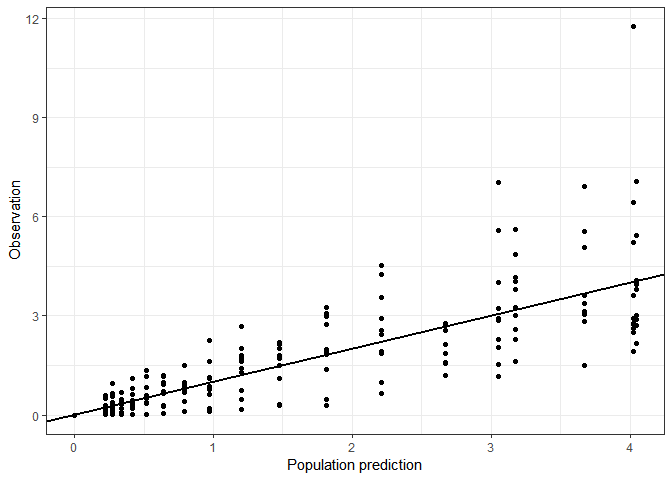

### 1-1. set the same limits

``` r
conc_min <- 0.01
conc_max <- 12

ggplot(data=df, aes(x=PRED, y=DV)) +
  geom_point() +
  geom_abline(intercept=0, slope=1, size=1) +
  theme_bw() +
  scale_x_continuous(limits=c(conc_min, conc_max)) +
  scale_y_continuous(limits=c(conc_min, conc_max)) +
  xlab("Population prediction") + ylab("Observation")
```

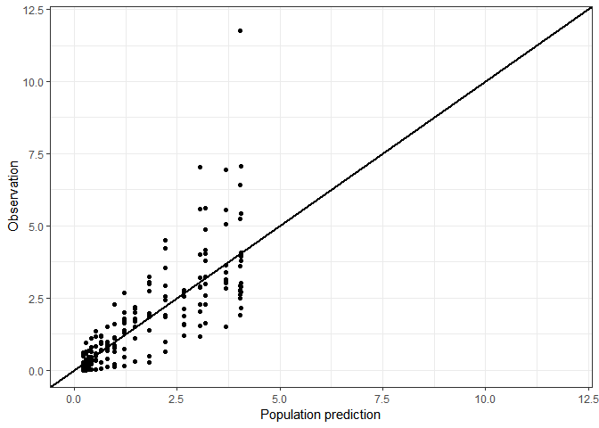

### 1-2. smoother function to see a trend

`span` 항목이 잘못된 해석을 유발할 수 있기 때문에 잘 쓰이지는 않는다.

``` r
ggplot(data=df, aes(x=PRED, y=DV)) +
  geom_point() +
  geom_abline(intercept=0, slope=1, size=1) +
  theme_bw() +
  scale_x_continuous(limits=c(conc_min, conc_max)) +
  scale_y_continuous(limits=c(conc_min, conc_max)) +
  xlab("Population prediction") + ylab("Observation") +
  geom_smooth(se=F, span=1)
```

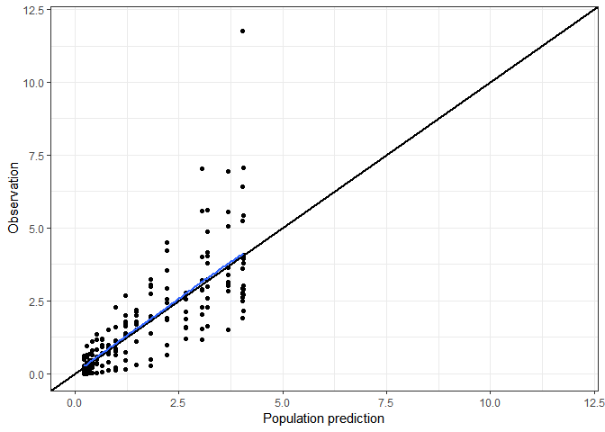

### 1-3. Replace PRED with IPRED

``` r
ggplot(data=df, aes(x=IPRE, y=DV)) +
  geom_point() +
  geom_abline(intercept=0, slope=1, size=1) +
  theme_bw() +
  scale_x_continuous(limits=c(conc_min, conc_max)) +
  scale_y_continuous(limits=c(conc_min, conc_max)) +
  xlab("Individual prediction") + ylab("Observation")
```

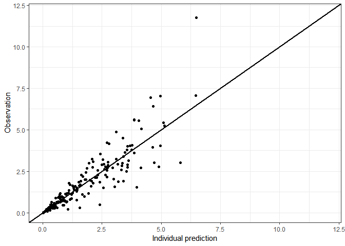

## 2. Conditional weighted residuals versus population predictions or time

CWRESI : FO conditional residuals with full interaction

**Objectives**
- useful in spotting model misspecification and immediately seeing where in your concentration-time profile this occurs(through concentrations, peak concentrations, absorption phase, etc).
- judge whether the distribution of the CWRESI is homogenous and the majority lies within the \[-2, 2\] acceptance interval

``` r
ggplot(df, aes(x=PRED, y=CWRESI)) +
  geom_point(size=1) +
  scale_x_continuous() +
  scale_y_continuous() +
  theme_bw() +
  ylab("CWRESI") + xlab("Population prediction")
```

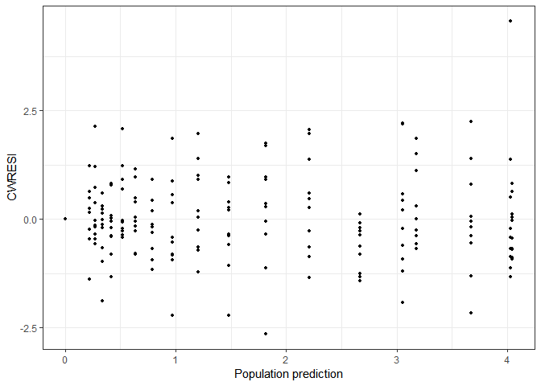

### 2-1. add three horizontal dashed lines (acceptance interval)

``` r
ggplot(df, aes(x=PRED, y=CWRESI)) +
  geom_point(size=1) +
  scale_x_continuous() +
  scale_y_continuous() +
  theme_bw() +
  ylab("CWRESI") + xlab("Population prediction") +
  geom_hline(yintercept=0) +
  geom_hline(yintercept=-2, color="grey", linetype="dashed") +
  geom_hline(yintercept=2, color="grey", linetype="dashed")
```

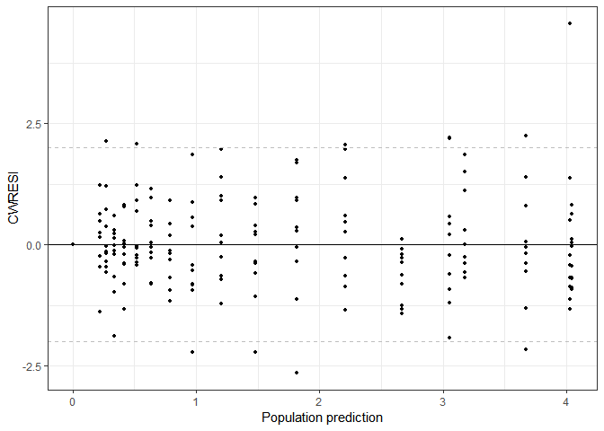

### 2-2. Add a smoother

``` r
ggplot(df, aes(x=PRED, y=CWRESI)) +
  geom_point(size=1) +
  scale_x_continuous() +
  scale_y_continuous() +
  theme_bw() +
  ylab("CWRESI") + xlab("Population prediction") +
  geom_hline(yintercept=0) +
  geom_hline(yintercept=-2, color="grey", linetype="dashed") +
  geom_hline(yintercept=2, color="grey", linetype="dashed") +
  geom_smooth(se=F, span=1)
```

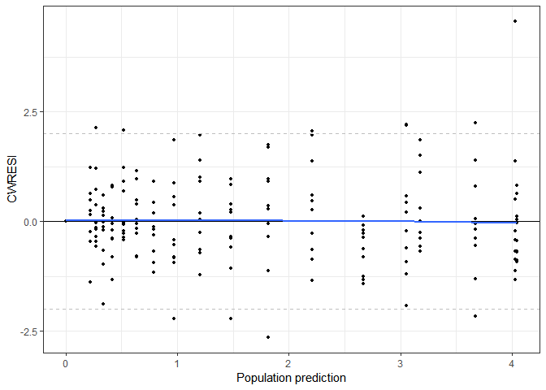

### 2-3. Replace PRED with TIME

``` r
ggplot(df, aes(x=TIME, y=CWRESI)) +
  geom_point(size=1) +
  scale_x_continuous() +
  scale_y_continuous() +
  theme_bw() +
  ylab("CWRESI") + xlab("Population prediction") +
  geom_hline(yintercept=0) +
  geom_hline(yintercept=-2, color="grey", linetype="dashed") +
  geom_hline(yintercept=2, color="grey", linetype="dashed") +
  geom_smooth(se=F, span=1)
```

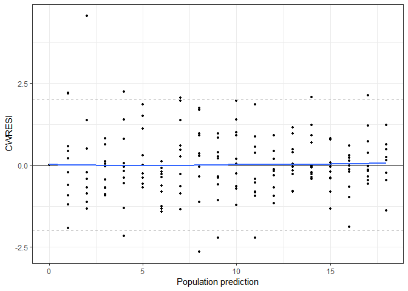

## 3. Individual + population model prediction and observations over time per individual

**objective**
- whether the model fits the individual observations accurately

### 3-1. 1 Individual graph

``` r
data_plot <- df[df$ID==1, ] # Select data from ID 1
ggplot(data=data_plot, aes(x=TIME, y=IPRE)) +
  geom_line(color="#001158") + # Individual predictions
  geom_line(data=data_plot, aes(x=TIME, y=PRED), color="red") + # Population predictions
  geom_point(data=data_plot, aes(x=TIME, y=DV), color="black") + # Observations
  theme_bw() +
  ylab("Concentration") +
  xlab("Time")
```

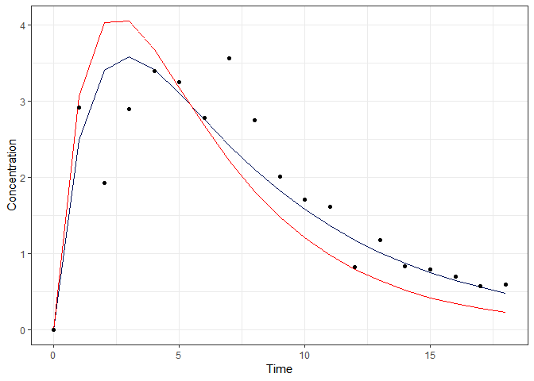

> -   observations (circles)
> -   the population model prediction (red line)
> -   individual model prediction (blue line)

### 3-2. 10 individuals graph

``` r
## Set the number of individuals per page
NumberOfPlotsPerPage <- 2

## Individual fit

for(i in 1:ceiling((length(unique(df$ID)))/NumberOfPlotsPerPage)){ ## Start loop here

subjects <- unique(df$ID)[(i*NumberOfPlotsPerPage-(NumberOfPlotsPerPage-1)):(i*NumberOfPlotsPerPage)]
subjects <- subjects[!is.na(subjects)] # Create a vector with new ID numbers

## Select a new batch of individuals
DataPlot <- df[df$ID %in% subjects,]

## Save as png
#png(paste('GOF_',i,'.png',sep=""),height=480,width=480,units='px',res=resolution)

# Create concentration-time profile
p<- ggplot(data = DataPlot, aes(x = TIME, y = IPRE)) +
geom_line(color = '#001158') +
geom_line(data = DataPlot, aes(x = TIME, y = PRED),color = 'red') + ## Population prediction = red
geom_point(data = DataPlot, aes(x = TIME, y = DV),color = 'black') + ## Individual prediction = blue
facet_wrap(~ID)+
theme_bw()+
ylab("Concentration")+
xlab("Time")

print(p)

dev.off()

}
```

``` r
## Set the number of individuals per page
NumberOfPlotsPerPage <- 2
manyindgraph <- function(numberofplotsperpage, pageind, ...) {
 ggplot(data = df, aes(x = TIME, y = IPRE)) +
    geom_line(color = '#001158') +
    geom_line(data = df, aes(x = TIME, y = PRED),color = 'red') + ## Population prediction = red
    geom_point(data = df, aes(x = TIME, y = DV),color = 'black') + ## Individual prediction = blue
    facet_wrap_paginate(~ID, ncol=numberofplotsperpage, nrow=1, page=pageind, sclaes=...) +
    theme_bw()+
    ylab("Concentration")+
    xlab("Time")
}

manyindgraph(2,1, "free")
```

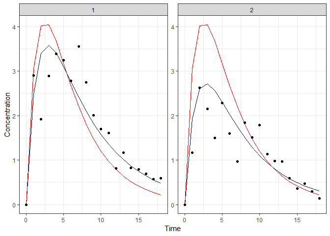

``` r
manyindgraph(2,2)
```

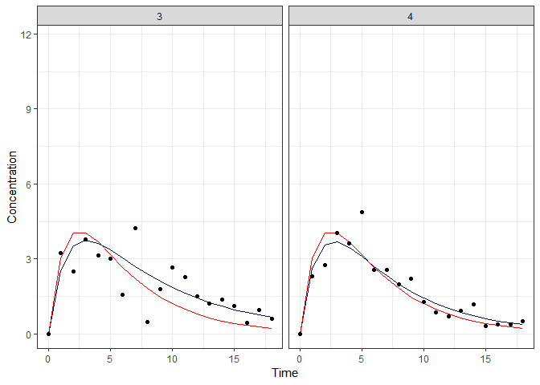

``` r
manyindgraph(2,3)
```

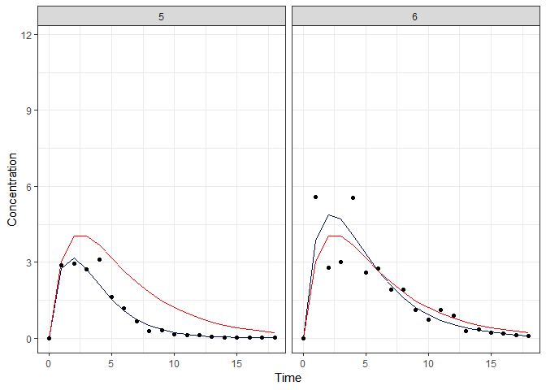

``` r
manyindgraph(2,4)
```

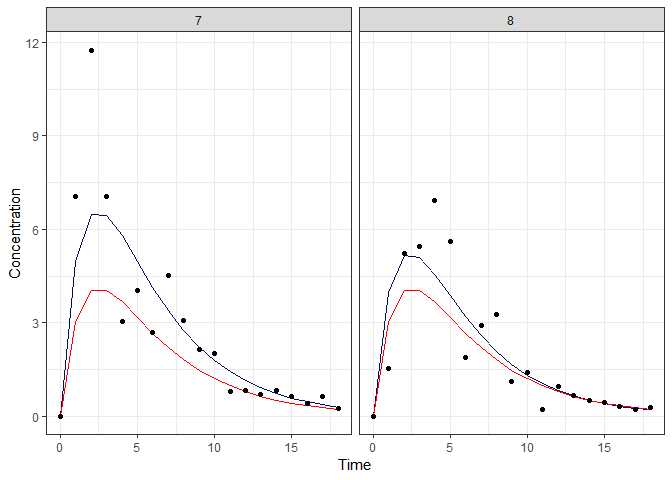

``` r
manyindgraph(2,5)
```

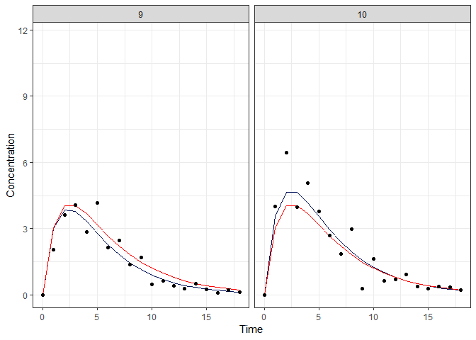

### Additional remarks

try not to fix the scales of the x- and y-axis but let them be estimated on the basis of the observations.

-   10%

``` r
axis_min <- min(df$DV) - min(df$DV)*0.1
axis_max <- max(df$DV) + max(df$DV)*0.1
```

## 4. Final R-script for NONMEM goodness of fit figures

pdf 파일 참조
``` r
##################################################################################
############################ CODING BLOCK ########################################
##################################################################################
# Run-Time Environment: R version 3.4.0
# Short title: NONMEM goodness of fit in R with ggplot2 package
#
# Datafiles used: Model output SDTAB
#
##################################################################################
##################################################################################
## Clean environment of previous objects in workspace
rm(list = ls(all.names= TRUE))
###

# Set version number of this script
version <- 1.0

## Load libraries used in this script
library(ggplot2) # For plotting
library(xpose4) # For read in NM output
library(cowplot) # For plotting multiple graphs

## Set variables needed in the script

# Set working directory where the NM output is located
setwd("C:/Users/User/Desktop/대학원/논문/A step-by-step guide to goodness of fit figures of NONMEM models in R using ggplot2")

# Set model name
model_name <- 'Model001'

## Concentration axis label
conc_axis_label <- "Concentration (ng/mL)"

## Time axis label
time_axis_label <- "Time (h)"

# How many plots per page with individual profiles?
NumberOfPlotsPerPage <-2

################
# Read dataset
# --------------

## Read in the output dataframe.
# The file SDTABModel001 will be read

df<-as.data.frame(read.nm.tables(paste('SDTAB',model_name,".txt",sep="")))

### If the header contains MDV, remove all MDV ==1
if("MDV" %in% colnames(df))
{
df<-df[df$MDV!=1,]
}

## Remove where DV = 0 if needed
df<-df[df$DV!=0,]

## Sometimes IPRED is used instead of IPRE, change this for consistency if needed
if("IPRED" %in% colnames(df))
{
names(df)[names(df) == 'IPRED'] <- 'IPRE'
}

## Set axis min and max, and check whether DV or IPRE is lowest/highest for plotting purposes
axis_min <- ifelse(min(df$DV) < min(df$IPRE), min(df$DV)- min(df$DV)*0.1,min(df$IPRE)- min(df$IPRE)*0.1)
axis_max <- ifelse(max(df$DV) > max(df$IPRE), max(df$DV)+ max(df$DV)*0.1,max(df$IPRE)+ max(df$IPRE)*0.1)

### Start creation of a pdf file here with an informative title
pdf(paste("GOF",model_name,Sys.Date(),version,"pdf",sep="."))

#########################################
## Create one page with the 4 GOF figures

DVPRED <- ggplot(data=df,aes(x=PRED,y=DV))+
geom_point()+
geom_abline(intercept = 0, slope = 1,size=1)+
scale_x_log10(limits = c(axis_min, axis_max), expand = c(0, 0)) +
scale_y_log10(limits = c(axis_min, axis_max), expand = c(0, 0)) +
labs(x="Population predictions",y="Observations") +
theme_bw()

DVIPRE <- ggplot(data=df,aes(x=IPRE,y=DV))+
geom_point()+
geom_abline(intercept = 0, slope = 1,size=1)+
scale_x_log10(limits = c(axis_min, axis_max), expand = c(0, 0)) +
scale_y_log10(limits = c(axis_min, axis_max), expand = c(0, 0)) +
labs(x="Individual predictions",y="Observations") +
theme_bw()

CWRESTIME <- ggplot(df,aes(x=TIME,y=CWRESI))+
geom_point(size=1)+
scale_x_continuous()+
scale_y_continuous(breaks=c(-4,-2,0,2,4))+
theme_bw()+
ylab("CWRESI")+
xlab(time_axis_label)+
geom_hline(yintercept = 0) +
geom_hline(yintercept = -2, color='grey', linetype='dashed')+
geom_hline(yintercept = 2, color='grey', linetype='dashed')

CWRESPRED <- ggplot(df,aes(x=PRED,y=CWRESI))+
geom_point(size=1)+
scale_x_continuous()+
scale_y_continuous(breaks=c(-4,-2,0,2,4))+
theme_bw()+
ylab("CWRESI")+
xlab("Population predictions")+
geom_hline(yintercept = 0) +
geom_hline(yintercept = -2, color='grey', linetype='dashed')+
geom_hline(yintercept = 2, color='grey', linetype='dashed')

## Combine plots on one page

plot_grid(DVPRED,DVIPRE,CWRESPRED,CWRESTIME,ncol=2)

## Individual profiles with model fit

for(i in 1:ceiling((length(unique(df$ID)))/NumberOfPlotsPerPage)){

subjects <- unique(df$ID)[(i*NumberOfPlotsPerPage-(NumberOfPlotsPerPage-1)):(i*NumberOfPlotsPerPage)]
subjects <- subjects[!is.na(subjects)]

## Select a new batch of individuals
DataPlot <- df[df$ID %in% subjects,]

# Create Individual plot on linear scale
p_lin<- ggplot(data = DataPlot, aes(x = TIME, y = IPRE)) +
geom_line(color = '#001158') +
geom_line(data = DataPlot, aes(x = TIME, y = PRED),color = 'red') +
geom_point(data = DataPlot, aes(x = TIME, y = DV),color = 'black') +
facet_wrap(~ID)+
theme_bw()+
ylab(conc_axis_label)+
xlab(time_axis_label)

print(p_lin)

# Create Individual plot on log scale
p_log<- ggplot(data = DataPlot, aes(x = TIME, y = IPRE)) +
geom_line(color = '#001158') +
geom_line(data = DataPlot, aes(x = TIME, y = PRED),color = 'red') +
geom_point(data = DataPlot, aes(x = TIME, y = DV),color = 'black') +
scale_y_log10()+
facet_wrap(~ID)+
theme_bw()+
ylab(conc_axis_label)+
xlab(time_axis_label)

print(p_log)

}

dev.off()

### End of Script ###
#####################
```
