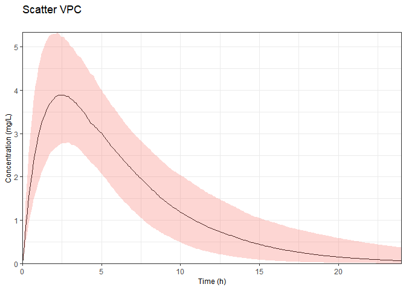

Scatter VPC
-----------

-   basic model evaluation tool for your population PD or PK/PD model
-   cf) confidence inverval VPC or pcVPC (don't use scatter VPC)
    -   highly influential covariates
    -   many different dosing levels
    -   irregular dosing intervals

Model simulation
----------------

A key characteristic of a VPC is that it is based on a simulation. Therefore, lets assume we have already developed our PK model and we want to start the simulation.

1.  we can use our dataset from model development to simulate the new observations.
2.  we can create a new dataset with observations at a time interval that was specified by the user \*\*

### libraries

``` r
library(mrgsolve) # for simulation
library(tidyverse)
```

### MODEL

``` r
code <- '
$THETA
0.673 14.3 3.05

$CMT GUT CENT


$MAIN
double KA = THETA1*exp(ETA(1));
double VC = THETA2*exp(ETA(2));
double CL = THETA3*exp(ETA(3));

$ODE
dxdt_GUT = -KA*GUT;
dxdt_CENT = KA*GUT - (CL/VC)*CENT;


$TABLE
capture IPRED = CENT/VC;
double DV = IPRED * (1 + EPS(1)) + EPS(2);

$CAPTURE DV


$OMEGA
0.1
0.0958
0.0961

$SIGMA
0.106 
0

$SET delta=0.1, end=24*3
'
```

directory에 ".cpp" 파일로 저장

### simulate

-   model : 1 Compartment - Linear elimination - Proportional residual error
-   24시간마다 100만큼 투여

``` r
mod <- mcode("mymodel", code)
```

    ## Building mymodel ... done.

``` r
nsamples <- 500 ### Number of simulated individuals
sim_time <- 24 ## Time of simulation
obs <- as.data.frame(ev(ID=1:nsamples,ii=24, cmt=1, amt=100, time=0))
obs <- obs[order(obs$ID,obs$time),]

out <- mod %>%
  data_set(obs) %>% 
  mrgsim(end=sim_time, delta=0.1) 
df <- as.data.frame(out)
head(df)
```

    ##   ID time       GUT      CENT        DV     IPRED
    ## 1  1  0.0   0.00000  0.000000 0.0000000 0.0000000
    ## 2  1  0.0 100.00000  0.000000 0.0000000 0.0000000
    ## 3  1  0.1  93.91969  5.988586 0.2299111 0.4627576
    ## 4  1  0.2  88.20907 11.435114 0.6278322 0.8836286
    ## 5  1  0.3  82.84569 16.377829 1.1918078 1.2655683
    ## 6  1  0.4  77.80841 20.852494 1.5197869 1.6113403

Analysis in R
-------------

``` r
###############################
##########
# Set the percentile intervals

PI <- 80 #specify prediction interval in percentage. Common is 80

perc_PI <- c(0+(1-PI/100)/2, 1-(1-PI/100)/2)

## Using DV = with residual error. Using IPRED = no residual error
sim_vpc <- df %>%
  group_by(time) %>% ## Set the stratification identifiers (e.g. TIME, DOSE, CMT, etc.)
  summarize(C_median = median(IPRED, na.rm = T),
  C_lower = quantile(IPRED, perc_PI[1], na.rm = T),
  C_upper = quantile(IPRED, perc_PI[2], na.rm = T))

ggplot() + geom_line(data=sim_vpc, aes(x=time, y=C_median)) +
  geom_ribbon(data = sim_vpc, aes(ymin=C_lower, ymax=C_upper, x=time, fill = "band"), alpha = 0.3) +
  theme_bw()+
  theme(axis.title=element_text(size=9.0))+
  theme(strip.background = element_blank(),
  strip.text.x = element_blank(),legend.position="none") +

  # Set axis labels
  labs(x="Time (h)",y="Concentration (mg/L)")+

  # Add vertical lines to indicate dosing at time 0
  geom_vline(xintercept = 0, linetype="dashed", size=1) +

  # Set axis
  scale_y_continuous(expand=c(0,0))+
  scale_x_continuous(expand=c(0,0))+

  ## Add title and subtitle
  ggtitle("Scatter VPC","")
```


